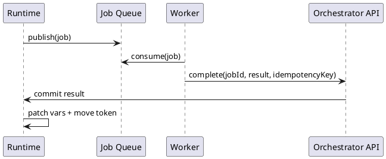
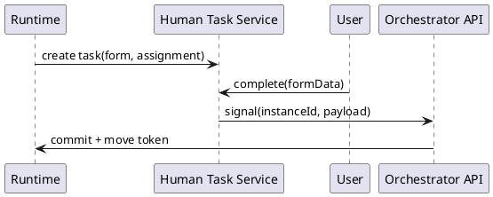

# Спецификация Модуля: Low-Code Оркестратор Процессов для SberCRM (v2)

## Введение

v2 добавляет к SberCRM полноценную low-code оркестрацию: визуальные процессы (граф шагов), durable execution, человеческие задачи, интеграции через коннекторы и наблюдаемость. Архитектура — микросервисная (для независимого масштабирования Runtime/Workers/Human Tasks).

## 1) Архитектура (микросервисы)

### 1.1 Карта сервисов (что есть и зачем)

| Сервис | Назначение | Хранение | Масштабирование |
|---|---|---|---|
| **Modeler UI** | Визуальный редактор процессов, формы human tasks, тестовый запуск, публикации | нет | по трафику UI |
| **API Gateway/Auth** | Единая точка входа, JWT/OAuth, rate limit, routing | нет | горизонтально |
| **Process Registry** | Реестр процессов и версий (draft/published/deprecated), хранение DSL + schema + checksum | Postgres | по QPS CRUD |
| **Orchestrator API** | Управление инстансами: start/signal/admin ops; приём job complete/fail | Postgres (shared runtime DB) | горизонтально |
| **Runtime Engine (Scheduler/Interpreter)** | Durable execution: токены, планирование jobs, вычисление переходов, ретраи, таймеры, компенсации | Postgres (shared runtime DB) | горизонтально (N replicas) |
| **Event Ingest** | Вебхуки/сообщения из внешних систем, корреляция по subscription | Postgres (runtime DB) | по входящим событиям |
| **Human Task Service** | Задачи людям: assignment, claim/complete, SLA, эскалации, формы | Postgres (human DB) | по активным задачам |
| **Worker Pool / Connector Services** | Выполнение service_task (HTTP/gRPC/CRM ops/SQL/email/sms), публикация результата | своё (опц.) | отдельно по каждому типу |
| **Observability Stack** | Метрики/логи/трейсы/таймлайн | TSDB/лог-стор | отдельно |

> Примечание: **Runtime DB** — один логический кластер Postgres (репликация/partitioning), используемый Runtime+Orchestrator+EventIngest. Human Task может иметь отдельную БД, но минимально допустимо хранить в том же кластере.

### 1.2 Связи между сервисами (диаграмма)

```plantuml
@startuml
skinparam componentStyle rectangle

component "Modeler UI" as UI
component "API Gateway/Auth" as GW
component "Process Registry" as REG
component "Orchestrator API" as API
component "Runtime Engine
(Scheduler + Interpreter)" as RT
component "Event Ingest" as EI
component "Human Task Service" as HT
queue "Job Queue" as Q
component "Worker Pool
(Connectors)" as W
component "Observability
(Logs/Metrics/Traces)" as OBS

database "Postgres
Registry DB" as DBR
database "Postgres
Runtime DB" as DBX
database "Postgres
Human DB" as DBH

UI --> GW
GW --> REG : CRUD моделей/версий
GW --> API : start/signal/admin
GW --> HT : tasks UI (list/claim/complete)

REG --> DBR
API --> DBX
RT --> DBX
EI --> DBX
HT --> DBH

API --> RT : control plane
(start/signal)
RT --> Q : publish jobs
W --> Q : consume jobs
W --> API : complete/fail

API --> OBS
RT --> OBS
EI --> OBS
HT --> OBS
W --> OBS
@enduml
```

### 1.3 Роли и ответственность сервисов (без воды)

#### Modeler UI
- Редактирует процесс как **DSL JSON** (nodes/edges/variables schema).
- Валидация графа (end достижим, join корректен, типы vars).
- Публикации: Draft → Published → Deprecated.

#### Process Registry
- Источник истины по дефинициям и версиям.
- Каждая публикация создаёт **immutable** `process_version`.

#### Orchestrator API
- `POST /instances` стартует процесс (выбирает latest published version, пишет instance+start tokens).
- Принимает callbacks воркеров: `complete/fail/heartbeat`.
- Admin ops: pause/resume/cancel/retryFromNode/migrate.

#### Runtime Engine
- Scheduler поднимает `ready` токены, создаёт `job`, переводит токен в `running`.
- Interpreter выполняет узлы типа `script/decision` локально, а `service_task` отдаёт воркерам.
- Реализует ретраи, таймеры, parallel fork/join, compensation.

#### Event Ingest
- Принимает внешние события (webhook/message).
- Находит `event_subscription` по `(event_type, correlation_key)`.
- Активирует ожидающие токены.

#### Human Task Service
- Создаёт human tasks, хранит SLA и assignment.
- По complete отправляет signal в Orchestrator.

#### Worker Pool / Connector Services
- Исполняют `service_task` (HTTP/gRPC/внутренние операции CRM).
- Гарантия at-least-once + идемпотентность по `idempotencyKey`.

---

## 2) DSL процесса (graph_json)

### 2.1 Формат

**ProcessVersion.graph_json**:
- `nodes: Node[]`
- `edges: Edge[]`
- `meta: {startNodeId, endNodeIds[]}`

**Node (общий контракт)**
- `id: string`
- `type: string` (см. 2.2)
- `name: string`
- `config: object` (type-specific)
- `inputMapping?: ExprMap`
- `outputMapping?: ExprMap`
- `retryPolicy?: RetryPolicy`
- `timeoutMs?: number`

**Edge**
- `from: string`
- `to: string`
- `condition?: Expr`
- `default?: boolean`

**RetryPolicy**
- `maxAttempts: number`
- `strategy: "fixed"|"exponential"`
- `initialDelayMs: number`
- `maxDelayMs?: number`
- `jitter?: boolean`

### 2.2 Типы узлов (минимальный набор)

| type | Назначение | config (минимум) |
|---|---|---|
| `start` / `end` | точки входа/выхода | `{}` |
| `service_task` | внешний вызов через коннектор | `{connector, request}` |
| `script` | вычисление выражений | `{expr}` |
| `decision` | правила/ветвление | `{rules[]}` |
| `timer` | задержка/cron | `{delayMs|cron}` |
| `event_wait` | ожидание события/вебхука | `{eventType, correlationKeyExpr, expiresMs?}` |
| `human_task` | задача человеку | `{formSchema, uiSchema, assignment, dueMs?}` |
| `fork` | параллель | `{branches: string[]}` |
| `join` | синхронизация | `{policy: "all"|"any"}` |
| `subprocess` | вызов другого процесса | `{processKey, inputMap, outputMap}` |
| `compensation` | откат (сага) | `{handlers: string[]}` |

### 2.3 Expression language (безопасно)
- Только whitelist функций, без доступа к сети/ФС.
- Контексты: `vars`, `instance`, `result`, `env`.

---

## 3) Runtime (durable execution)

### 3.1 Семантика выполнения
- **At-least-once** для внешних задач.
- Идемпотентность: `idempotencyKey = instanceId:nodeId:attempt`.
- Дедупликация: уникальный индекс на `job.dedupe_key`.

### 3.2 Модель состояния
- `process_instance` — состояние процесса + `vars_json`.
- `instance_token` — положение токена на node.
- `job` — единица работы (queued/running/succeeded/failed).
- `event_subscription` — ожидание событий.

### 3.3 Планировщик (Scheduler)
- Берёт `ready` токены с блокировкой:
  - `SELECT ... FOR UPDATE SKIP LOCKED`
- Создаёт `job(queued)` и ставит токен `running`.
- TTL recovery: если `lock_until < now()` → токен считается свободным.

### 3.4 Завершение job
- `complete`:
  - применить `outputMapping` → patch `vars_json`
  - токен → `completed`
  - активировать следующие токены по edges (условия/дефолт)
- `fail`:
  - увеличить attempt
  - если attempt < maxAttempts → пересчитать `next_run_at` и вернуть `queued`
  - иначе → `token failed` и (опц.) запустить compensation

---

## 4) Очередь и воркеры

### 4.1 Job Queue
- Асинхронный транспорт jobs (Kafka/RabbitMQ).
- Партиционирование по `processKey` или `instanceId` (для нагрузки/упорядочивания).

### 4.2 Worker SDK (контракт)
- Consume: получает `{jobId, instanceId, nodeId, payload, attempt, deadline}`
- Heartbeat: продление дедлайна для long-running
- Complete/Fail: отправка результата в Orchestrator API

---

## 5) Human Tasks

### 5.1 Assignment
- `assigneeExpr` или `candidateRoles[]`.
- Опционально: auto-assign правило (expr).

### 5.2 SLA
- `due_at = now + dueMs`
- Эскалации: notify/reassign/create supervisor task.

---

## 6) События (Eventing)

- `event_wait` создаёт `event_subscription(eventType, correlationKey)`.
- `Event Ingest` принимает событие и активирует токен.

---

## 7) Схема БД (минимально необходимая)

| Таблица | Ключевые поля | Индексы |
|---|---|---|
| `process_definition` | id, key(unique), name, status | key |
| `process_version` | id, definition_id, version, graph_json, variables_schema_json, checksum | (definition_id, version) unique |
| `process_instance` | id, definition_id, version_id, business_key, status, vars_json | (status, started_at) |
| `instance_token` | id, instance_id, node_id, state, locked_by, lock_until | (instance_id, state) |
| `job` | id, instance_id, token_id, node_id, status, attempt, next_run_at, dedupe_key | (status, next_run_at), dedupe_key unique |
| `event_subscription` | id, instance_id, event_type, correlation_key, status | (event_type, correlation_key, status) |
| `human_task` | id, instance_id, node_id, assignee_id, status, due_at | (assignee_id, status), (due_at) |
| `audit_log` | id, actor, action, entity_type/id, at | (entity_type, at) |

---

## 8) API контракты (минимум, чтобы строить)

### 8.1 Registry API
- `POST /process-definitions`
- `POST /process-definitions/{id}/versions` (draft)
- `POST /process-versions/{id}/publish`
- `GET /process-definitions/{key}/versions/latest` (published)

### 8.2 Orchestrator API
- `POST /instances` {processKey, businessKey?, initialVars}
- `POST /instances/{id}/signal` {eventType, correlationKey, payload}
- `POST /jobs/{id}/complete` {result, idempotencyKey, durationMs}
- `POST /jobs/{id}/fail` {error, idempotencyKey, retryOverride?}
- `POST /jobs/{id}/heartbeat`
- `GET /instances/{id}`
- `GET /instances/{id}/timeline`
- Admin: `POST /instances/{id}/pause|resume|cancel|retryFromNode|migrate`

### 8.3 Human Task API
- `POST /human-tasks/{id}/claim`
- `POST /human-tasks/{id}/complete` {formData}
- `GET /human-tasks?assignee=...&status=open`

---

## 9) Потоки (визуально)

### 9.1 Service Task (job → worker → commit)


### 9.2 Human Task (create → complete → signal)


---

## 10) План реализации (коротко, по микросервисам)

1) **Registry + Modeler**: CRUD процессов/версий + публикации + валидация графа.
2) **Runtime DB + Scheduler/Interpreter**: tokens/jobs + service_task/script/decision.
3) **Job Queue + Worker SDK + 1-2 коннектора**: HTTP + внутренний CRM-op.
4) **Orchestrator API**: start/signal + complete/fail + timeline.
5) **Human Task Service**: формы + assignment + claim/complete + SLA.
6) **Event Ingest**: webhooks + correlation.
7) **Hardening**: retries/timeouts, fork/join, compensation, migrate, observability.

